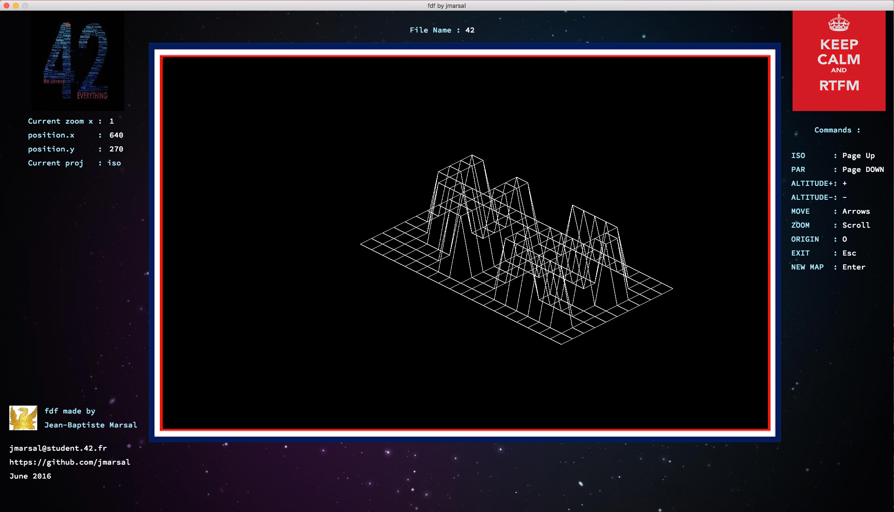
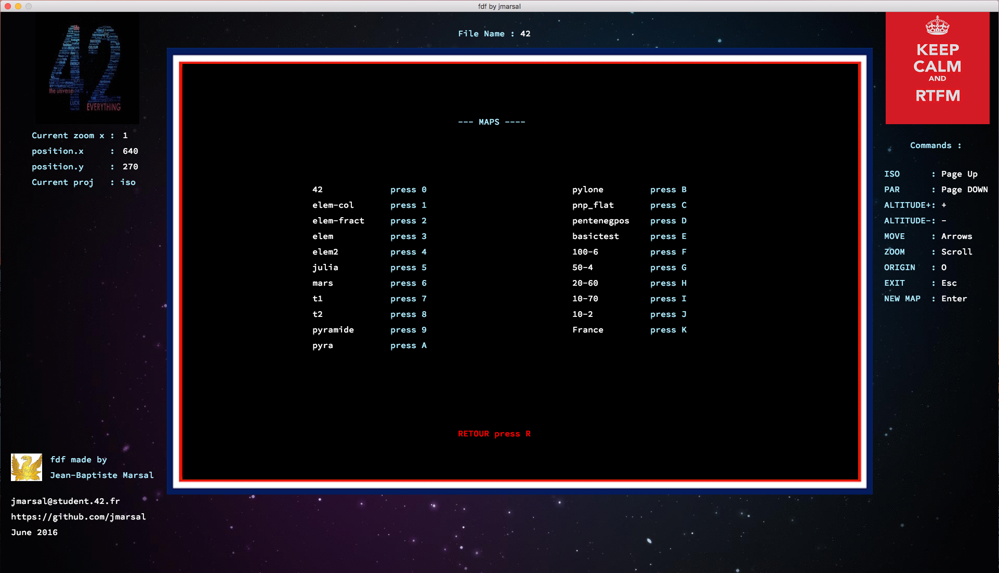
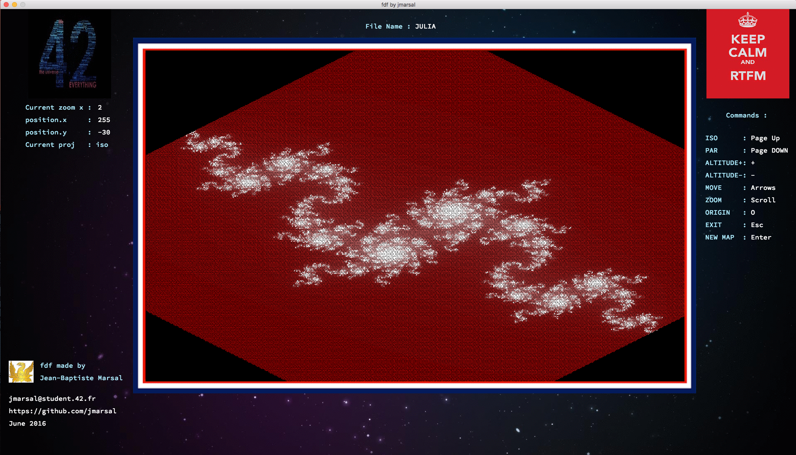
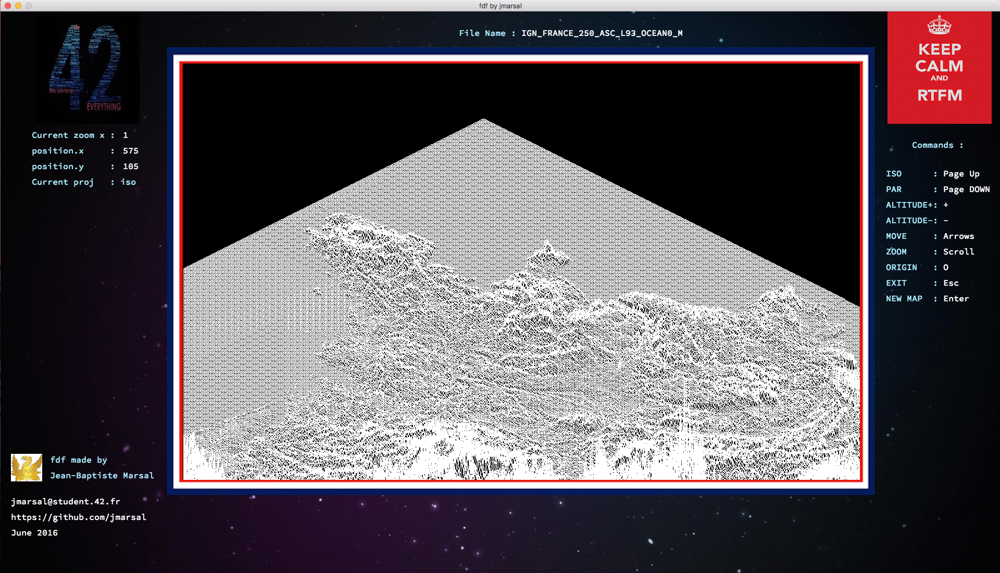

****

## Contributeur
[@jmarsal](https://github.com/jmarsal)

# Projet Fdf 42
Vous decouvrirez dans ce projet les bases de la programmation graphique, et en particulier,
le placement de points dans l’espace, comment les relier avec des segments et
surtout comment observer la scène depuis un certain point de vue.
Vous découvrirez également votre première bibliothèque graphique : La miniLibX.
Cette bibliothèque développée en interne rassemble le minimum nécéssaire pour ouvrir
une fenêtre, allumer un pixel et gérer les évènements lié à cette fenêtre : le clavier, la
souris et l’“expose”. Ce sera pour vous l’occasion de vous initier à la programmation dite
“evenementielle”. 

## Note Final
`125 / 100`

## Manuel
1. `Make`
2. `./fdf maps/[maps]`

